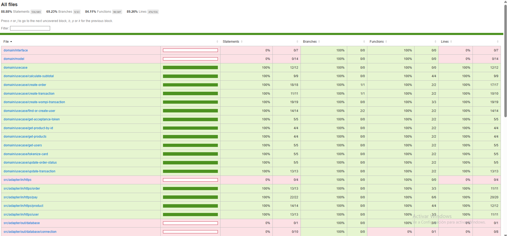
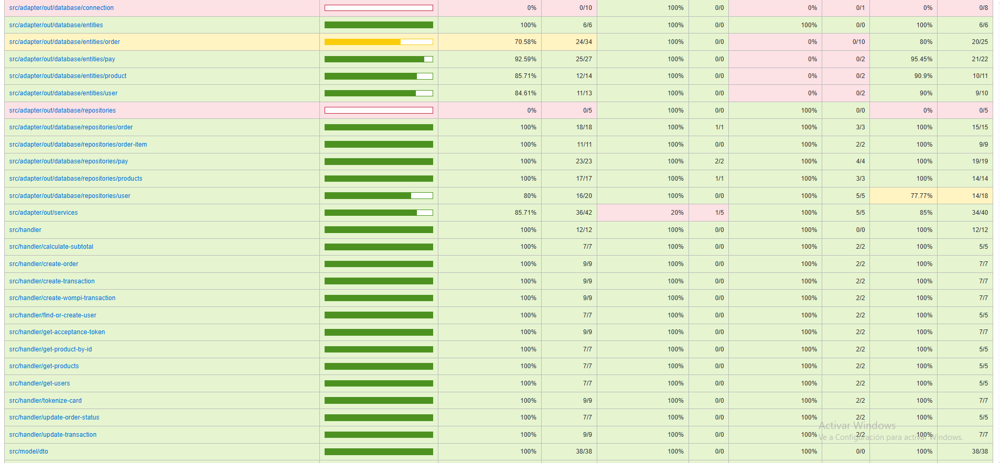

# Wompi Ecommerce Backend

## Overview
This project is a backend microservice for an ecommerce platform focused on processing payments for products. It is built using the NestJS framework and follows a clean architecture pattern with clear separation of concerns between domain, adapters, handlers, and controllers. The service integrates with Wompi payment gateway to handle transactions securely.

## Technology Stack
- **Node.js** with **TypeScript**
- **NestJS** framework for building scalable server-side applications
- **TypeORM** as ORM for database interactions
- **SchemaDatabase** 
- **PostgreSQL** as the primary relational database
- **Docker** and **Docker Compose** for containerization and local development
- **AWS ECS** for deployment with CI/CD via GitHub Actions
- **Jest** for unit and integration testing
- **Swagger** for API documentation

## Architecture and Folder Structure

- `src/`
  - `adapter/`
    - `in/https/`: HTTP controllers handling incoming requests
    - `out/database/`: Database entities, repositories, connection, and seeds
    - `out/services/`: External service integrations (e.g., Wompi)
  - `common/`: Common modules, configuration, and migrations
  - `handler/`: Application handlers implementing business logic for use cases
  - `model/`: DTOs and data models used across the application
  - `app.module.ts`: Main application module registering controllers and providers
  - `main.ts`: Application entry point, bootstraps NestJS app and Swagger docs

- `domain/`
  - `interface/`: Interfaces for repositories, services, and logger abstraction
  - `model/`: Domain models and types
  - `usecase/`: Business use cases implementing core application logic


## Setup Instructions

### Prerequisites
- Node.js 18+
- npm
- Docker and Docker Compose (for containerized setup)
- PostgreSQL database (can be run via Docker Compose)

### Environment Variables
The application expects the following environment variables (can be set in `.env` file):

```
PORT=3000
DB_HOST=localhost
DB_PORT=5432
DB_USERNAME=your_db_user
DB_PASSWORD=your_db_password
DB_NAME=your_db_name
WOMPI_BASE_URL=
WOMPI_PUBLIC_KEY=
WOMPI_PRIVATE_KEY=
WOMPI_INTEGRITY_KEY=
```

### Installation
```bash
npm install
```

### Database Setup
Run database migrations and seed initial data:

```bash
npm run typeorm:run
```

This will build the project, run migrations, and seed the database.

## Running the Application

### Development Mode
```bash
npm run start:dev
```
Starts the app with hot-reloading.

### Production Mode
```bash
npm run start:prod
```
Runs the compiled JavaScript from the `dist` folder.

### Docker
Build and run the app with Docker:

```bash
docker build -t wompi-eccomerce-backend .
docker run -p 3000:3000 wompi-eccomerce-backend
```

Or use Docker Compose to start PostgreSQL and the app together:

```bash
docker-compose up
```

## API Documentation
Swagger UI is available at: `url/api`

url = 

## Testing

Run unit and integration tests with Jest:

```bash
npm test:cov
```







## Linting and Formatting

Lint the codebase and fix issues:

```bash
npm run lint
```

Format code with Prettier:

```bash
npm run format
```

## Deployment

The project uses GitHub Actions to deploy to AWS ECS on pushes to the `main` branch. The workflow:

- Checks out code
- Configures AWS credentials
- Builds and pushes Docker image to Amazon ECR
- Runs database migrations inside a container
- Updates the ECS service to deploy the new version


## Database Schema

The database schema consists of the following main tables and their relationships:

- **users**: Stores user information with unique email and creation timestamp.
- **products**: Stores product details including name, description, stock, image URL, and price in cents.
- **orders**: Represents customer orders with status, total amount, and relation to the user who placed the order.
- **order_items**: Items within an order, linking products to orders with quantity.
- **pay**: Payment transactions related to orders.
- **pay_log**: Logs related to payment transactions.

### Relationships

- A user can have multiple orders.
- An order belongs to one user.
- An order has multiple order items.
- Each order item links to one product.
- Each order has one payment transaction.


## Additional Notes

- The project uses a hexagonal architecture with clear separation of concerns.
- Uses NestJS validation pipes globally for input validation.
- Integrates with Wompi payment gateway via a dedicated service module.
- Database seeding scripts are available under `src/adapter/out/database/seeds`.
- Logging is done using NestJS Logger.


